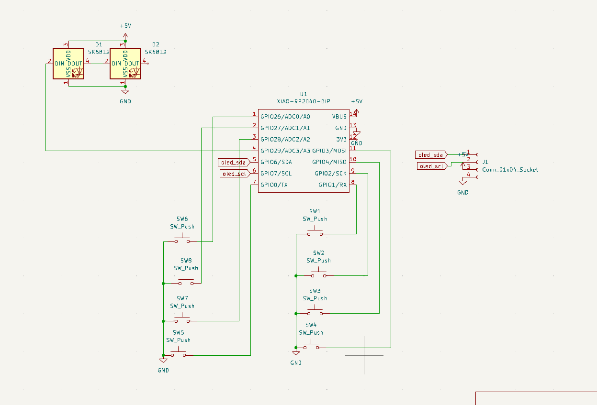
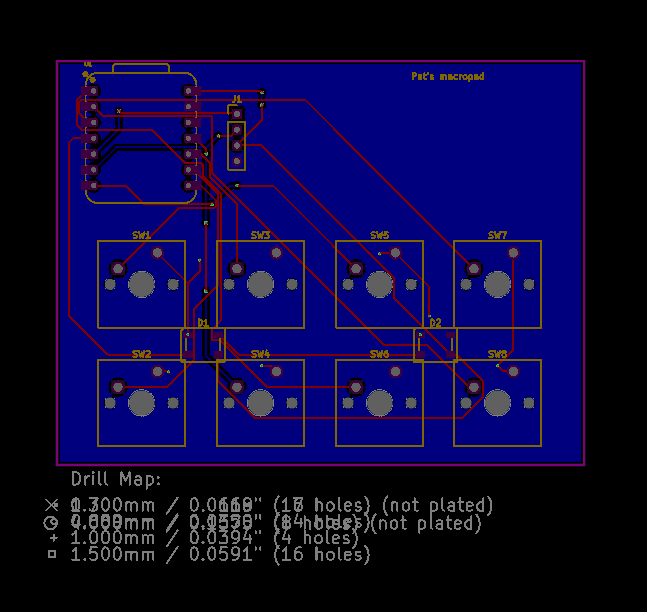
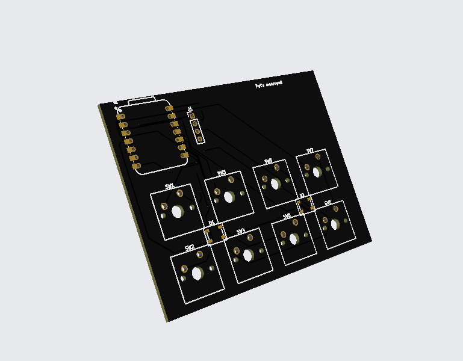
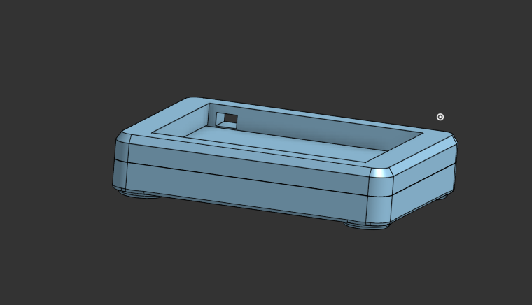

# Pat's macropad
this was made for [highway](https://highway.hackclub.com) 
like some of the other projects on my github

## Features
- 8 keys
- oled display
- multiple modes / key presets

## PCB
Here are pictures of my pcb:

| **Schematic** | **PCB** |
|---------------|---------|
|||

[x] I ran DRC and there are 0 errors

## CAD

top and bottom are joined with m3 screws and heat inserts

## Firmware

The display tells you what mode you are in and in can be cycled with one of the keys

## BOM
- 1 SEEEDUINO XIAO RP2040
- 8x hackpad switches
- 8x hackpad keycaps
- 1x hackpad oled display
- 2x hackpad neopixels
- 4x M3x16mm screws
- 4x M3x5mx4mm heatset inserts
